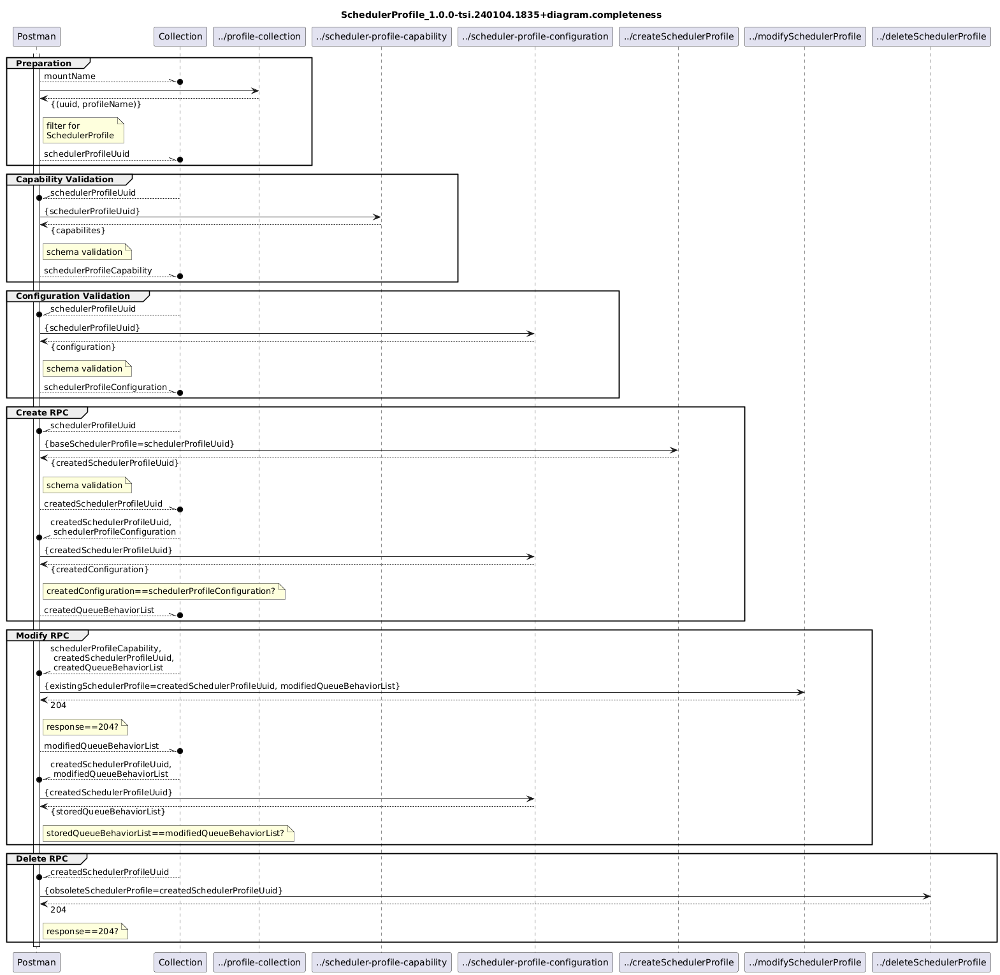

# SchedulerProfile_1.0.0-tsi.240104.1835+validator  

### Completeness
- [SchProf_1.0.0-tsi.240104.1835+validator.completeness](./Completeness/SchProf_1.0.0-tsi.240104.1835+validator.completeness.json)  
- [SchProf_1.0.0-tsi.240104.1835+data.completeness](./Completeness/SchProf_1.0.0-tsi.240104.1835+data.completeness.json)  
-   